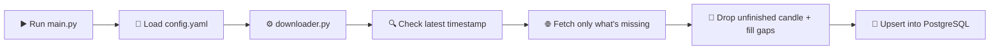

<div align="center">


# 📈 CryptoSight

**A self-healing crypto market-data pipeline that just... works.**

Point it at Binance or Bybit. Walk away. Come back to a spotless, gap-free,
duplicate-free OHLCV history sitting in your own PostgreSQL database — every
single time you run it.


</div>

---

## 🤔 Why does this exist?

Anyone who has tried to build a backtest, a dashboard, or a trading bot on
top of exchange data knows the real problem isn't *getting* candles — it's
getting candles you can actually **trust**:

- Did the fetch get cut off halfway and leave a silent gap?
- Did you accidentally re-download and duplicate six months of data?
- Is that timestamp in UTC, your local time, or the exchange's server time?
- Is the very last candle even *finished*, or are you about to store a
  half-formed bar as if it were real?

CryptoSight exists so you never have to think about any of that again. It
checks what you already have, fetches only what's missing, throws away the
one candle that isn't closed yet, and writes everything back in clean,
timezone-independent UTC. Run it once, run it a hundred times — the result
is identical.

---

## ✨ Features

| | |
|---|---|
| 🔁 **Auto-Resume** | Reads the latest timestamp already in your database and picks up exactly where it left off — no gaps, no duplicate rows |
| 🏦 **Multi-Exchange** | Binance and Bybit out of the box, both behind the same clean interface |
| 🌍 **Timezone-Safe by Design** | Every timestamp is normalized to UTC before it ever touches the database — no `+05:00` surprises three months later |
| 🧩 **Gap Handling** | Missing candles get forward-filled or linearly interpolated — you choose the strategy per run |
| ✂️ **No Half-Baked Candles** | The most recent (still-forming) candle is always dropped before saving, so every row in your DB represents a fully closed period |
| 🗄️ **Self-Provisioning Schema** | First run auto-creates the schema and table for each exchange/symbol/timeframe combo — zero manual SQL |
| 📐 **Built-in Resampling** | Pull your stored 1-minute data and roll it up into 4h, 1d, or any custom higher timeframe on demand |
| 🔐 **Zero API Keys Required** | Historical OHLCV data is public — nothing to leak, nothing to rotate, nothing to lock down |

---

## 🏗️ How It Works



1. **Start** — run the entry point for an exchange: `python data/binance/main.py`
2. **Configure** — symbols, timeframe, and start date all come from that exchange's `config.yaml`
3. **Check** — the pipeline asks Postgres "what's the newest candle you already have?"
4. **Fetch** — only the missing range is pulled from the exchange API, with automatic retries on failure
5. **Clean** — the in-progress candle is dropped, gaps are filled per your configured strategy
6. **Save** — everything is upserted into PostgreSQL, keyed on timestamp, so re-runs are always safe

---

## 📁 Project Structure

```text
cryptosight/
├── data/
│   ├── binance/
│   │   ├── binance_client_exch.py   # Binance historical-klines client
│   │   ├── config.yaml              # Symbols, timeframe, date range for Binance
│   │   └── main.py                  # Entry point: python data/binance/main.py
│   ├── bybit/
│   │   ├── bybit_client_exch.py     # Bybit client with forward-chunk pagination
│   │   ├── config.yaml              # Symbols, timeframe, date range for Bybit
│   │   └── main.py                  # Entry point: python data/bybit/main.py
│   └── downloader.py                # Orchestrator: resume logic, cleaning, upsert, resampling
├── utils/
│   ├── db.py                        # PostgreSQL connection + schema/table management (UTC-forced)
│   └── logger.py                    # Shared logger
├── logs/                            # Per-exchange execution logs (git-ignored)
├── .env                             # Database credentials — never committed
├── requirements.txt
└── README.md
```

---

## 🚀 Quickstart

### 1. Install dependencies

```bash
python -m venv venv
venv\Scripts\activate        # Windows
pip install -r requirements.txt
```

### 2. Point it at your database

Create a `.env` file in the project root:

```env
DB_HOST=localhost
DB_PORT=5432
DB_NAME=postgres
DB_USER=your_username
DB_PASSWORD=your_password
```

### 3. Tell it what to fetch

Edit `data/binance/config.yaml` or `data/bybit/config.yaml`:

```yaml
symbols:
  - "BTC"
  - "ETH"
  - "SOL"
timeframe: "1m"
start_time: "2026-06-22 00:00:00"
end_time: "now"
fill_method: "ffill"
```

### 4. Run it

```bash
python data/binance/main.py
python data/bybit/main.py
```

That's it. Run it again tomorrow, next week, or next year — it will only
ever fetch what's new.

---

## 🛠️ Advanced: Resampling stored data

Already have months of 1-minute candles and want a 4-hour view without
re-fetching anything? `resample_ohlcv` pulls straight from your database
and aggregates it for you:

```python
from cryptosight.data.downloader import resample_ohlcv

merged_df, resampled_4h = resample_ohlcv(
    exchange="bybit",
    symbol="BTC",
    timeframe="1m",
    target_timeframe="4h"
)
```

---

## 🗺️ Roadmap

- [ ] Finish wiring live-exchange data into the merge step of `fetch_and_merge_missing_data` (currently DB-only)
- [ ] Add more exchanges (OKX, Coinbase)
- [ ] Optional real-time WebSocket ingestion alongside historical backfill
- [ ] CLI flags to override `config.yaml` without editing files

---

## 🤝 Contributing

Found a bug, a gap in the data logic, or want to add another exchange?
Issues and PRs are welcome — this is an actively evolving pipeline, not a
finished museum piece.

---

<div align="center">

**If CryptoSight saved you from writing yet another janky data-fetch script — a ⭐ is appreciated.**

</div>
